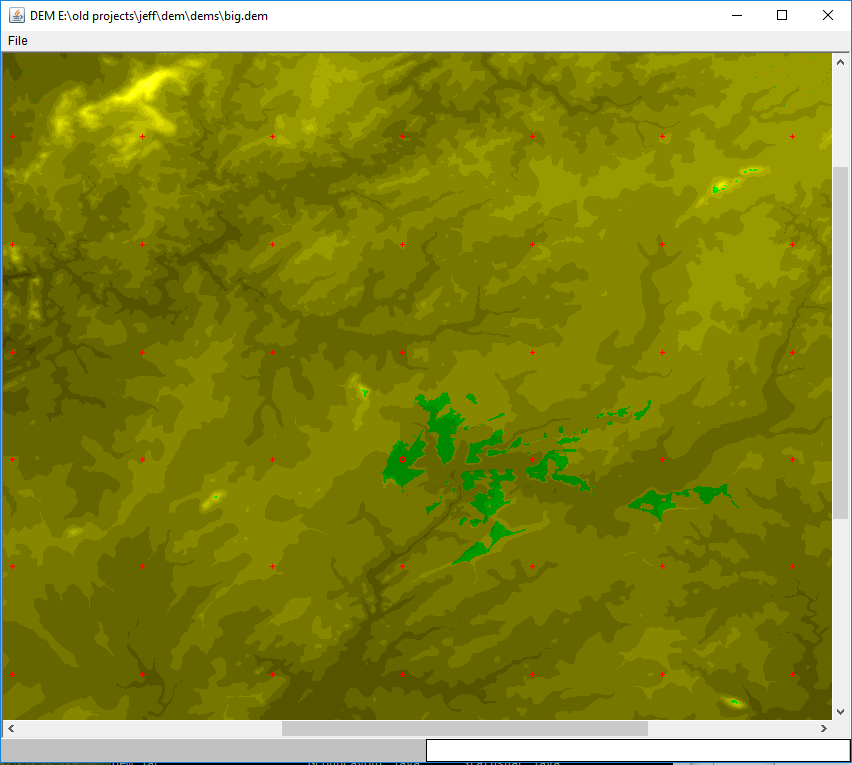

#dem

This is a Java GIS application I wrote for my CS final project in 1998.

It uses Digital Elevation Model files from the USGS as input, and can 
produce plots that show radio coverage based on terrain analysis.

Like many 20-year-old projects, this may not be so useful any more, but
I can still see that the VHF coverage from my home is really pretty awful 

The paper that goes with the software is here, too, in Microsoft Word and
in PDF format.

Perhaps somebody may find this useful.

n1kdo 20180128
